# Venue Access Management for Olympic Officials System(VAMOOS) 2016

### Contents

1. Project Description
2. System Look
3. Installation
4. The Repository
5. Future Development
6. Help

### 1. Project Description  
This is a group project, completed for the Computer Science Development Exercise module in the 2015-16 academic year. My group scored 93%, which was the second best final mark across all students' groups. I was responsible for most of the back-end and front-end parts of the system, with a main concentration on a correct functionality followed by the client's User Acceptance Testing(UAT). I also focused on the User Interface Design, based on the Nielsen's 10 Usability Heuristic Principles including visibility of system status, error prevention, aestetic and minimalist design, as well as help and documentation. 
  

The main functions of the system are to:
- manage the authorisations which allow Officials to enter Rio Olympic venues for sports events,
- respond to and log results of requests to enter venues by Officials.
  
The VAMOOS system can handle data about:
- the Officials and their ID cards, sports, their events and event venues,
- authorisation of cards to enter venues,
- response to requests by a card to enter a venue for an event,
- the log of actual entries to venues by Officials.

The system was created using EasyPHP WAMP Stack platform with the CodeIgniter framework and Grocery CRUD library. 
<b>Languages used:</b> HTML, CSS, PHP and SQL(for storing data about Officials). 

### 2. System Look
The below are screenshots of the running system.

### 2.1 Login page

 
### 2.2 Home screen after logging in 
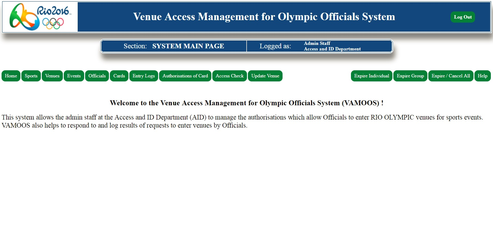

### 2.3 'Sports' tab
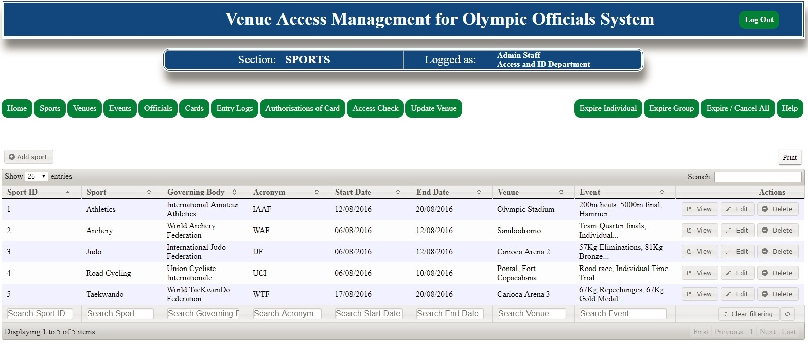

### 2.4 'Venues' tab
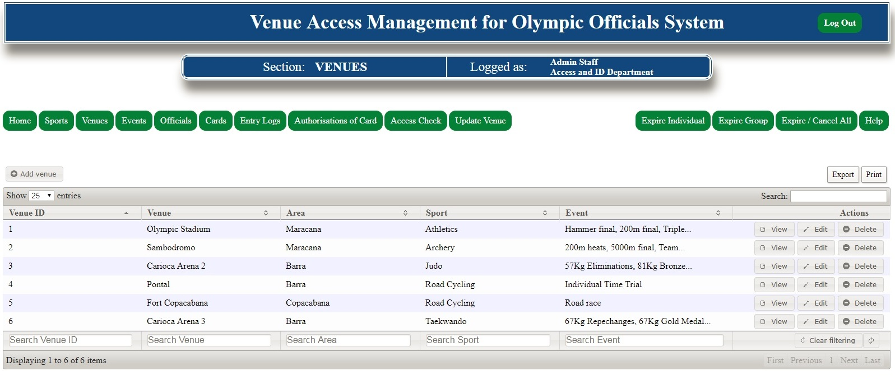

### 2.5 'Events' tab
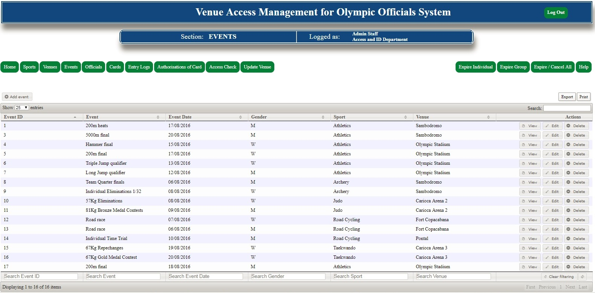

### 2.6 'Officials' tab
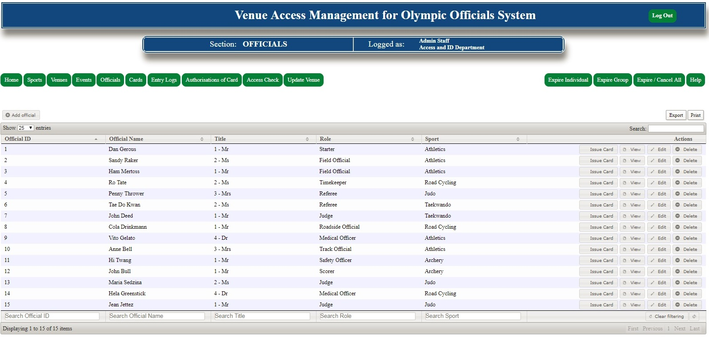

### 2.7 'Cards' tab
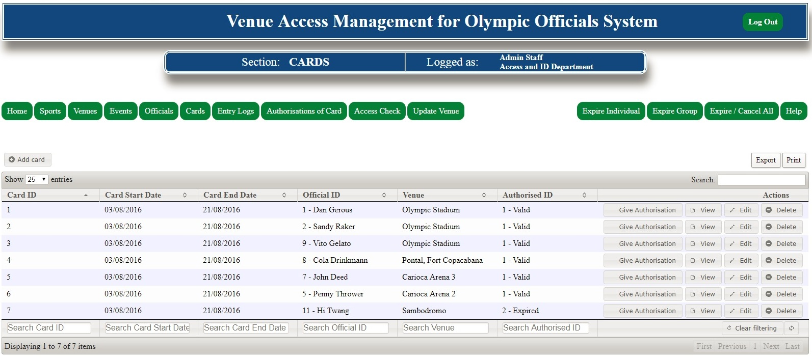

### 2.8 'Entry Logs' tab
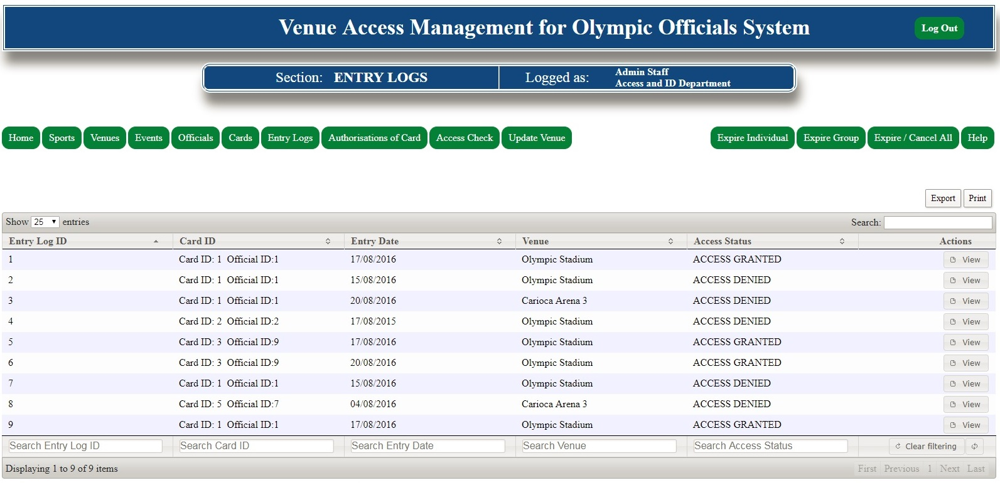

### 2.9 'Authorisations of Card' tab
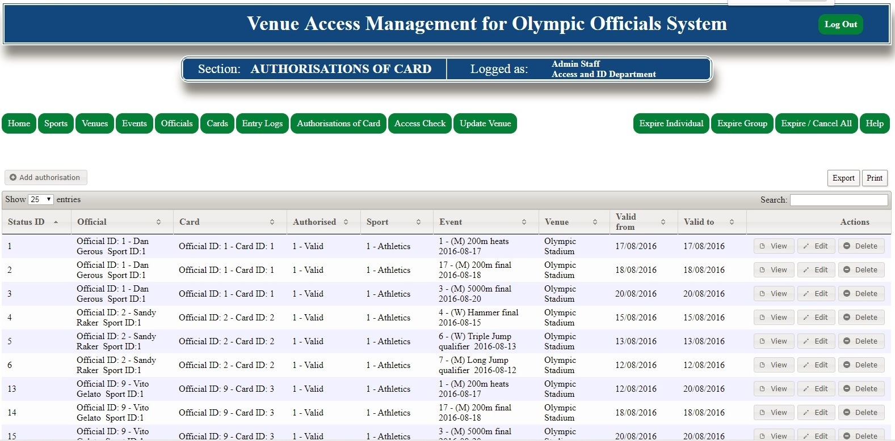

### 2.10 'Access Check' tab
#### 2.10.1 'Access Check' - initial view
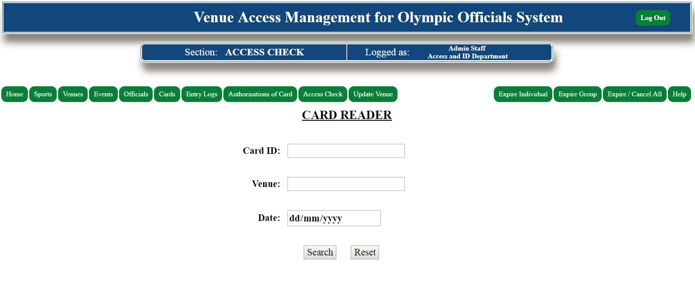

#### 2.10.2 'Access Check' - data input (correct)
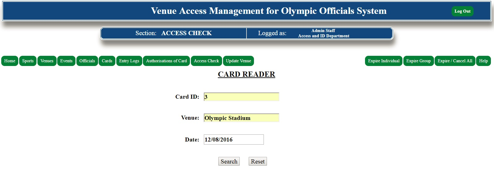

#### 2.10.3 'Access Check' - access GRANTED
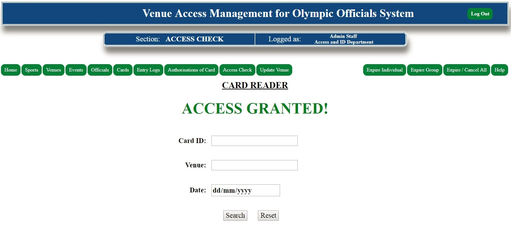

#### 2.10.4 'Access Check' - data input 2 (incorrect)
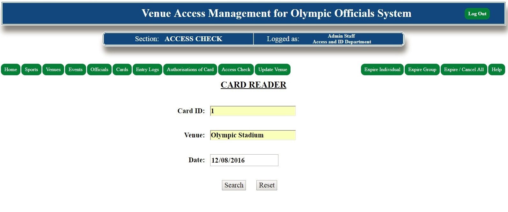

#### 2.10.5 'Access Check' - access DENIED
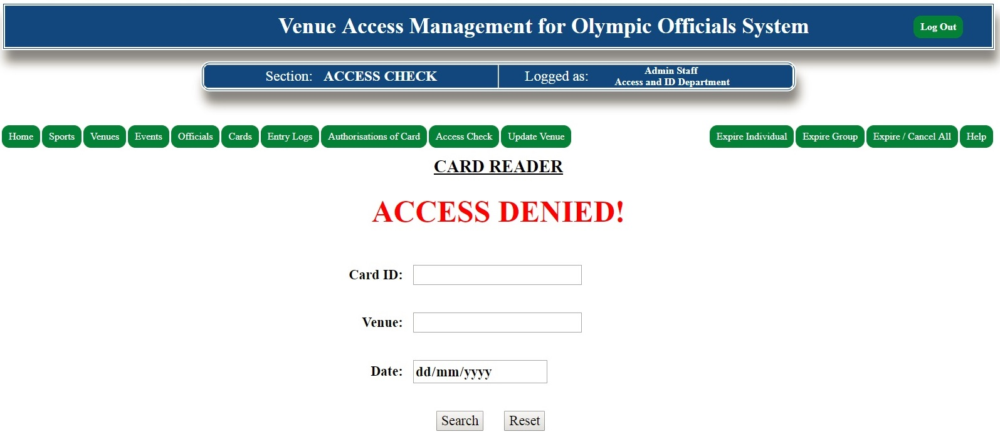

### 2.11 'Update Venue' tab
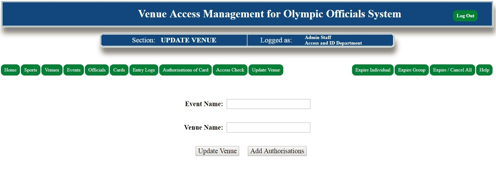

### 2.12 'Expire Individual' tab
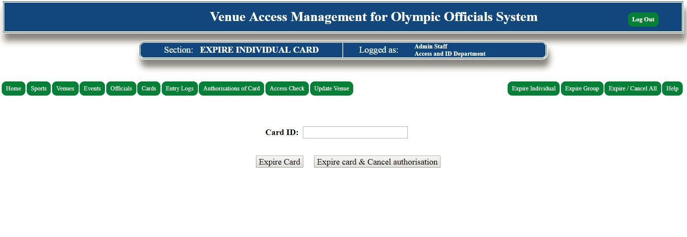

### 2.13 'Expire Group' tab
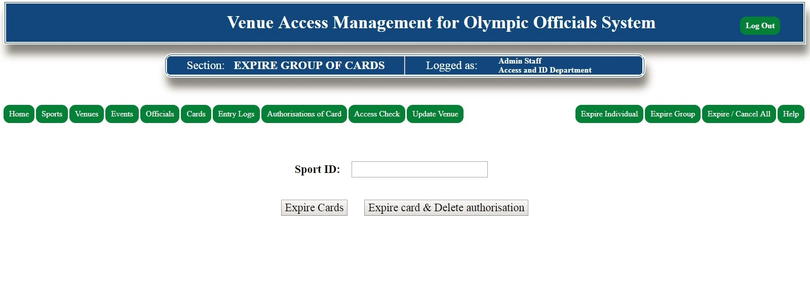

### 2.14 'Expire/Cancel All' tab
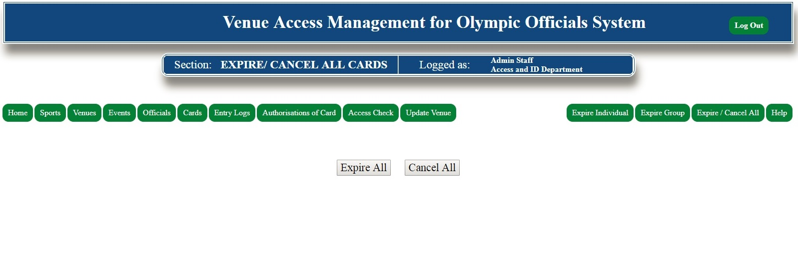

### 2.15 'Help' tab
#### 2.15.1 'Help' - top of the page view
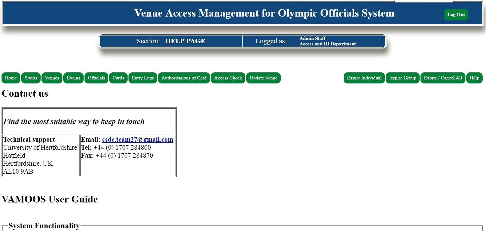

#### 2.15.2 'Help' - further page snippet of the Help section
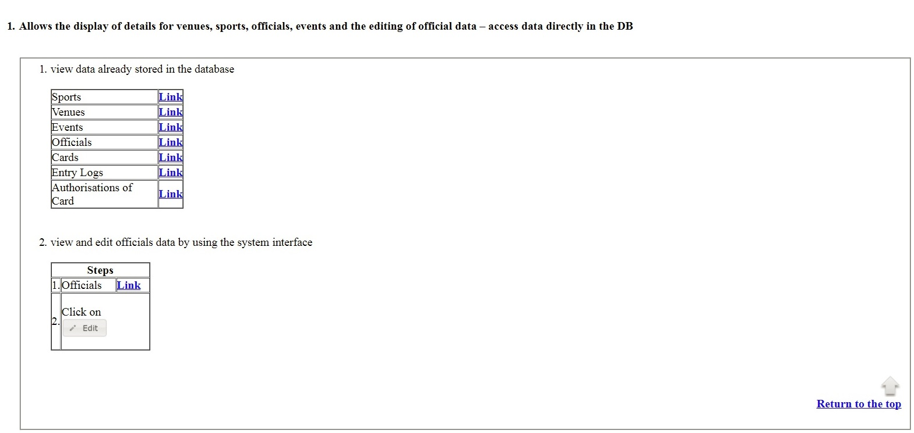

### 3. Installation  
1. Download EasyPHP development platform from:
http://www.easyphp.org/

2. Go to EasyPHP/data/localweb and paste all 'vamoos' directory.

3. Run EasyPHP

4. Open a browser and type in: localhost:8080/phpmyadmin

5. Go to "Databases" tab

6. Create a new database called "vamoos" and drop "orders" database.

7. Go to "Import" and import 'vamoos.sql' from the 'vamoos' directory.

8. Go to localhost:8080/vamoos
   You will be presented with the VAMOOS System Login Page

9. In order to test the system, login as one of the AID users, e.g.:
login: f.lampard@vamoos.com 
password: frank

### 4. The Repository  
- systemEvaluation, teamRoles - information about my roles/responsibilities in this project, system functionality, project's analysis and reflection
- systemMiscellaneous - Data Dictionary (including database information on tables/columns names, data types, primary/foreign keys and similar), Test Plan (including system's tests with test data and expected/actual outcome), Entity-Relationship diagram
- systemPictures - pictures of a running system
- vamoos - the actual directory with the project, including 'vamoos.sql' database file
### 5. Future Development  
Future development of this management system may include:
- users' passwords encryption and their storage as encrypted data in a database
- assure full automation of the system has been reached
- add RIO 2016 logo to all tabs (not only Login and Home sections)
- improve help section

### 6. Help  
Please do not hesitate to contact me on the below e-mail if you encounter any problems or need further information.
Contact: <b>lukaszbol[at]yahoo[dot]co[dot]uk</b>

